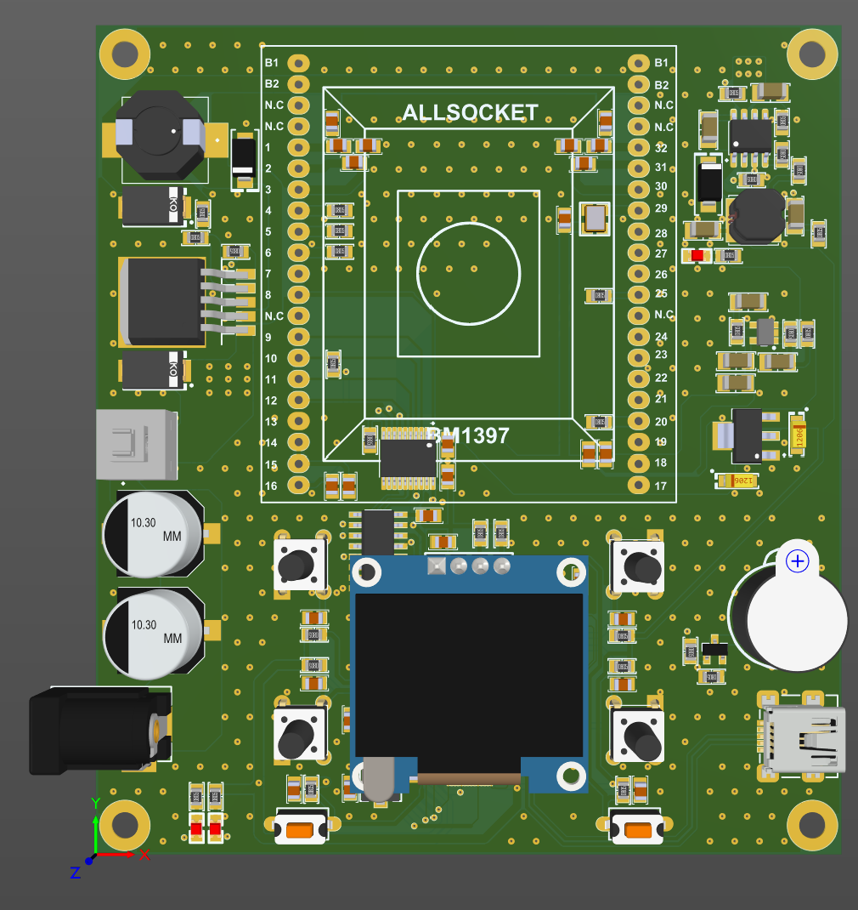

<h1> BM1397 chips tester </h1>
This device test used BM1397 chips from Antminer. 
It mesure input and output Voltage of Data Pins.
Powered By RP2040 Raspberry pi chip.

<h2> Programme </h2>
programming Coming soon :)

<h2>Image</h2>

